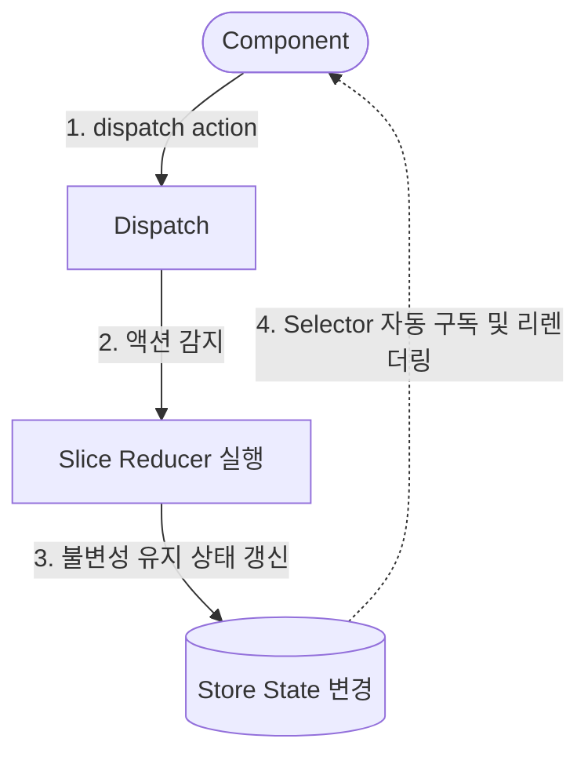
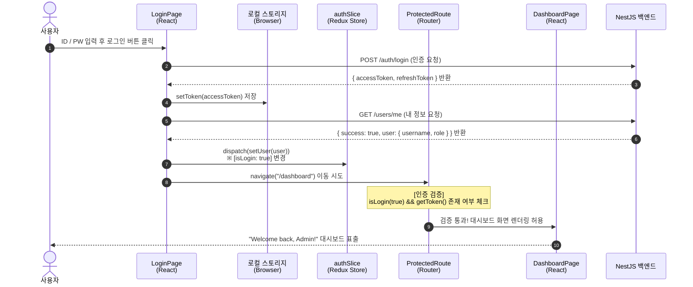
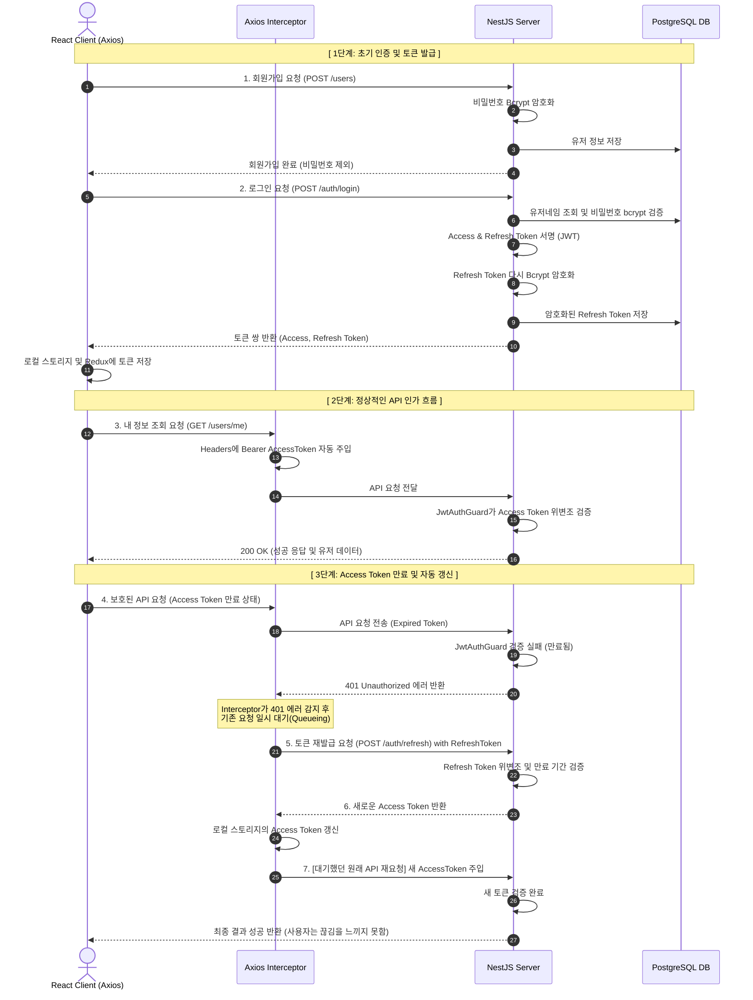
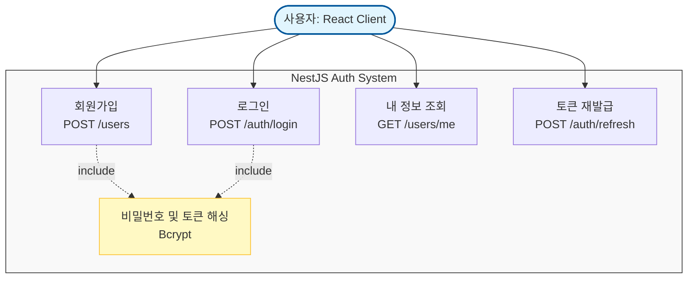

# 🚀 Modern React Admin Template

DevOps 관점에서의 전체 개발 플로우 이해와 기초 아키텍처 구성을 위한 현대적인 프론트엔드 어드민 템플릿입니다.  
과거의 `CRA + Webpack` 표준에서 탈피하여, 요즘 실무 트렌드인 **Vite, TypeScript, Redux Toolkit, shadcn/ui** 구조를 적용해 압도적인 속도와 타입 안정성을 확보했습니다.

---

## 🛠️ Tech Stack (기술 스택)

| 영역 | 기술 스택 | 비고 |
| :--- | :--- | :--- |
| **Frontend** | React (v18+) | 선언형 UI 및 Component 기반 아키텍처 |
| **Build Tool** | Vite | 가상 DOM 및 Native ESM 기반 초고속 개발 서버 |
| **Language** | TypeScript | 정적 타입 검사를 통한 런타임 에러 방지 |
| **UI Library** | shadcn/ui (Tailwind CSS) | Radix UI 기반의 컴포넌트 복사/붙여넣기형 디자인 시스템 |
| **Router** | React Router (DOM) | 클라이언트 사이드 라우팅 (SPA 구조 구현) |
| **State** | Redux Toolkit (RTK) | 복잡한 보일러플레이트를 줄인 중앙 집중식 상태 관리 |
| **API Client** | Axios | 인터셉터를 활용한 JWT / Keycloak 토큰 인증 처리 |

---

## 🏗️ Project Structure (프로젝트 구조)

```text
src/
 ├── api/           # API 통신 전용 영역 (Axios Instance & HTTP Methods Wrapper)
 │    ├── api.ts     # Axios 인스턴스 및 인터셉터 설정 (토큰 주입)
 │    ├── client.ts  # 공통 get/post 추상화 함수
 │    ├── auth.ts    # 인증 관련 API
 │    └── users.ts   # 유저 관련 API
 ├── components/    # 공통 UI 컴포넌트 및 재사용 UI
 │    ├── MainLayout.tsx
 │    ├── Sidebar.tsx
 │    └── ui/        # shadcn/ui 컴포넌트 (button, card, input 등)
 ├── lib/           # 유틸 함수 및 공통 기능 (환경변수, 포맷터, 헬퍼)
 ├── pages/         # 라우트별 독립적인 페이지 컴포넌트 (Dashboard, Users, Settings)
 ├── router/        # 라우팅 인프라 관리 및 네비게이션 메뉴 자동화 데이터
 ├── store/         # Redux Toolkit 전역 상태 관리 저장소
 │    ├── index.ts   # 중앙 전역 상태 스토어 생성 및 타입 정의 (RootState, AppDispatch)
 │    ├── hooks.ts   # 타입 자동화 훅 (useAppSelector, useAppDispatch)
 │    └── slices/    # 도메인별 상태 영역 (authSlice, uiSlice)
 ├── types/         # 데이터 모델 및 DTO 등 공통 TypeScript 타입 정의
 ├── App.tsx        # 앱 최상위 라우터 연결 컴포넌트
 ├── main.tsx       # React 진입점 (DOM 렌더링 및 Redux Provider 바인딩)
 └── index.css      # Tailwind CSS 및 글로벌 스타일 지정

```

---

## 🔄 Redux Toolkit 데이터 플로우

본 프로젝트는 상태 변경의 예측 가능성을 높이기 위해 단방향 데이터 흐름(Flux 아키텍처)을 엄격히 준수합니다.

### 1. 핵심 개념 매핑

* **Store**: 애플리케이션의 전체 전역 상태를 저장하는 단 하나의 중앙 저장소.
* **Slice**: 상태 영역별(auth, ui 등) 데이터, 리듀서, 액션을 모듈화한 단위.
* **Reducer**: 이전 상태와 액션을 받아 '불변성'을 유지하며 새로운 상태를 리턴하는 함수.
* **Action**: 상태를 어떻게 변경할지 나타내는 데이터 객체 (변경 요청서).
* **Dispatch**: 액션을 리듀서로 보내 상태 변경을 트리거하는 실행 함수.
* **Selector**: 전역 스토어에서 컴포넌트에 필요한 특정 상태만 골라내어 구독하는 훅.

### 2. 데이터 흐름 다이어그램



---

## 🔑 Authentication (인증 체계)

* **JWT / Keycloak 연동**:
* `api/api.ts` 내부의 **Request Interceptor**를 통해 API 호출 시 로컬 스토리지 또는 세션에 있는 토큰을 `Authorization: Bearer <TOKEN>` 헤더에 자동으로 주입합니다.
* 로그인/회원가입 등 토큰이 필요 없는 공개 API 요청 시에는 `{ auth: false }` 옵션을 전달하여 인터셉터의 토큰 주입 흐름을 안전하게 차단(Bypass)합니다.


---

## ⚡ Getting Started (시작하기)

### 1. 의존성 패키지 설치

```bash
npm install
# 또는 yarn install / pnpm install

```

### 2. 로컬 개발 서버 구동 (Vite)

번들링 과정 없이 Native ESM을 활용하여 즉시 서버가 실행됩니다.

```bash
npm run dev

```

### 3. 프로덕션 빌드 (Rollup 기반 최적화)

```bash
npm run build

```

## 로컬 스토리지 기반 인증 아키텍처 흐름

### 1. 컴포넌트별 역할 및 데이터 흐름 요약

| 파일명 / 컴포넌트 | 핵심 역할 (Responsibility) | 다루는 데이터 및 상태 | 인증 통과 조건 / 액션 결과 |
| :--- | :--- | :--- | :--- |
| **`LoginPage.tsx`** | 사용자의 로그인 인증을 처리하고 초기 전역 상태를 빌드하는 진입점 | `username`, `password` (Local State) | 로그인 성공 시 Access Token을 스토리지에 기록하고, `setUser` 액션을 디스패치하여 후속 가드를 활성화함. |
| **`Router.tsx`** | URL 경로에 따라 전체 화면을 분기하고 첫 진입 시 리다이렉트 흐름 통제 | `isLogin` (Redux), `getToken()` (Storage) | 현재 인증 상태에 따라 루트(` / `) 진입 시 `/dashboard` 또는 `/login`으로 자동 포워딩함. |
| **`ProtectedRoute.tsx`** | 인가되지 않은 비로그인 유저의 대시보드 내부 진입을 차단하는 보안 성벽 | `isLogin` (Redux), `getToken()` (Storage) | `isLogin`이 `true`이고 스토리지에 토큰이 동시에 존재해야 내부 화면(`<Outlet />`) 렌더링을 허용함. |
| **`authSlice.ts`** | React 앱 전역에서 유지할 로그인 유저의 인적 정보 및 상태 메모리 저장소 | `user` (인적 정보 객체), `isLogin` (boolean) | `setUser()` 호출 시 글로벌 로그인 세션 활성화, `logout()` 호출 시 전역 인증 데이터를 초기화함. |
| **`Sidebar.tsx`** | 좌측 메뉴 네비게이션 렌더링 및 하단 유저 프로필/로그아웃 제어 | `currentUser` (Redux), `isLogin` (Redux) | 로그아웃 클릭 시 `logout()` 액션을 실행하고, 로컬 스토리지 내 토큰 찌꺼기를 완전 삭제(`removeToken`)함. |

---

### 2. 로그인 및 인증 가드 구동 파이프라인

1. **인증 요청 및 토큰 적재**: 
   사용자가 `LoginPage`에서 계정 정보를 입력하면 백엔드 API를 통해 `accessToken`을 발급받아 로컬 스토리지에 저장(`setToken`)합니다.
2. **유저 정보 동기화**: 
   로그인 직후 백엔드의 내 정보 API(`getMe`)를 조회하여, 수신한 유저 객체를 Redux 스토어(`authSlice`)에 `setUser` 액션으로 주입합니다. 이 단계에서 `isLogin` 상태가 `true`로 전환됩니다.
3. **라우터 가드(Gatekeeping) 통과**: 
   `Maps("/dashboard")` 호출 시 `ProtectedRoute`가 Redux의 `isLogin`과 스토리지를 검사합니다. 두 보안 조건이 모두 만족되면 대시보드 및 내부 관리 패널의 문이 열립니다.

## 인증 관련 흐름 정리
- 인증 유스케이스

- 인증 시퀀스 다이어그램
